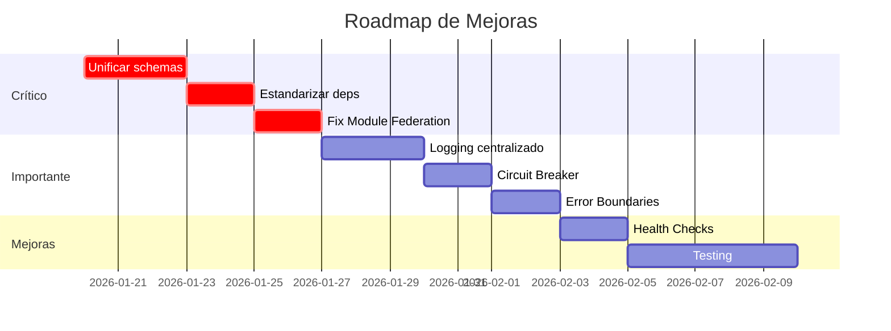

# Auditoría de Arquitectura - Sistema Municipal

> **Fecha de Auditoría:** Enero 2026
> **Versión del Proyecto:** 1.0.0
> **Revisado por:** Análisis Senior de Infraestructura

---

## Resumen Ejecutivo

El proyecto **sistema-municipal** es un monorepo que implementa una arquitectura de microfrontends con microservicios. La estructura general es sólida y sigue patrones modernos de desarrollo enterprise. Sin embargo, se identificaron áreas de mejora críticas y recomendaciones para escalar el proyecto de manera sostenible.

### Puntuación General

| Categoría | Puntuación | Estado |
|-----------|------------|--------|
| Estructura del Monorepo | 8/10 | ✅ Bueno |
| Module Federation (MF) | 7/10 | ⚠️ Requiere ajustes |
| Microservicios | 6/10 | ⚠️ Requiere mejoras |
| Gestión de Dependencias | 5/10 | ❌ Crítico |
| Patrones de Código | 7/10 | ⚠️ Inconsistencias |
| Seguridad | 6/10 | ⚠️ Requiere refuerzo |
| DevOps/CI-CD | 8/10 | ✅ Bueno |

---

## 1. Estructura del Monorepo

### ✅ Lo que está bien

```
sistema-municipal/
├── apps/
│   ├── microfrontends/     # Separación clara de frontends
│   │   ├── mf_shell/       # Host application
│   │   ├── mf_store/       # Estado compartido (Redux)
│   │   ├── mf_ui/          # Componentes UI compartidos
│   │   └── mf_contabilidad/# Módulo de dominio
│   └── microservices/      # Separación clara de backends
│       ├── api-gateway/    # Punto de entrada único
│       ├── api-autorizacion/
│       ├── api-identidad/
│       └── api-contabilidad/
├── packages/
│   └── shared/             # Código compartido (schemas, tipos)
├── docs/                   # Documentación
└── infra/                  # Infraestructura
```

**Fortalezas:**
- Uso de Turborepo para orquestación de builds
- pnpm como package manager (eficiente en disco)
- Separación clara entre apps y packages
- Configuración de workspaces correcta en `pnpm-workspace.yaml`

### ❌ Problemas Identificados

1. **Schemas duplicados entre microservicios**
   - Los schemas de Drizzle están duplicados en cada microservicio
   - Debería usarse `@municipal/shared` para todos los schemas

2. **Falta de package `@municipal/config`**
   - Configuraciones de biome, typescript, etc. están duplicadas
   - Se recomienda crear un package de configuración compartida

### Recomendación

```
packages/
├── shared/           # Schemas DB, tipos, utilidades
├── config/           # Configuraciones compartidas (tsconfig, biome, etc.)
├── ui/               # Alternativa a mf_ui como package (opcional)
└── utils/            # Utilidades comunes (validación, formateo)
```

---

## 2. Microfrontends - Module Federation

### Análisis de `@originjs/vite-plugin-federation`

#### ✅ Lo que está bien

1. **Configuración del Host (mf_shell)**
```typescript
// vite.config.ts - mf_shell
federation({
  name: "mf_shell",
  remotes: remoteUrls,  // URLs desde variables de entorno ✅
  shared: {
    react: {},
    "react-dom": {},
    "@mui/material": {},
    // ... dependencias compartidas
  },
})
```

2. **Configuración de Remotes**
```typescript
// vite.config.ts - mf_store
federation({
  name: "mf_store",
  filename: "remoteEntry.js",
  exposes: {
    "./store": "./src/store/index.ts",
  },
  shared: { /* ... */ },
})
```

#### ❌ Problemas Críticos

##### 2.1 Inconsistencia de Versiones en `shared`

**Problema:** Las dependencias compartidas no especifican versiones ni estrategias de carga.

| Paquete | mf_shell | mf_store | mf_ui | mf_contabilidad |
|---------|----------|----------|-------|-----------------|
| react | 19.1.0 | 19.1.0 | 19.1.0 | 19.1.0 |
| @mui/material | 7.1.1 | ❌ | 7.1.2 | 7.1.2 |
| @reduxjs/toolkit | 2.8.2 | ^2.8.2 | ❌ | 2.8.2 |
| @mui/x-tree-view | 8.5.1 | ❌ | ❌ | 7.29.1 |

**Solución Recomendada:**
```typescript
// Configuración estandarizada para TODOS los MF
shared: {
  react: {
    singleton: true,
    requiredVersion: "^19.1.0",
  },
  "react-dom": {
    singleton: true,
    requiredVersion: "^19.1.0",
  },
  "@mui/material": {
    singleton: true,
    requiredVersion: "^7.1.0",
  },
  "@reduxjs/toolkit": {
    singleton: true,
    requiredVersion: "^2.8.0",
  },
  "react-redux": {
    singleton: true,
    requiredVersion: "^9.2.0",
  },
}
```

##### 2.2 mf_contabilidad consume mf_store pero también expone

**Problema:** `mf_contabilidad` es híbrido (consume y expone), lo cual puede causar problemas de inicialización.

```typescript
// mf_contabilidad/vite.config.ts
federation({
  exposes: {
    "./Button": "./src/components/Button.tsx",
    "./routes": "./src/routes/routes.tsx",
    "./components": "./src/page/index.ts",
  },
  remotes: {
    mf_store: env.VITE_MF_STORE_URL,  // También consume
  },
})
```

**Riesgo:** Dependencias circulares y race conditions en la carga.

**Solución:** Documentar claramente el orden de carga y considerar lazy loading.

##### 2.3 Falta de Fallbacks

**Problema:** No hay manejo de errores cuando un remote no está disponible.

**Solución Recomendada:**
```typescript
// En mf_shell, implementar ErrorBoundary para cada remote
const ContabilidadModule = React.lazy(() =>
  import("mf_contabilidad/routes").catch(() => ({
    default: () => <ErrorFallback module="Contabilidad" />
  }))
);
```

---

## 3. Microservicios

### 3.1 API Gateway

#### ✅ Lo que está bien

- Uso de `http-proxy-middleware` para routing
- Configuración de timeouts por servicio
- Logging estructurado con Pino
- Headers de seguridad básicos

#### ❌ Problemas Identificados

**3.1.1 Responsabilidades Mezcladas**

El Gateway actual hace demasiado:
- Proxy reverso ✅
- Rate limiting ✅
- CORS ✅
- Seguridad (Helmet) ✅
- ~~Autenticación~~ (debería estar aquí pero no está)

**Debería agregar:**
- Validación de JWT antes de proxy
- Circuit breaker para servicios caídos
- Caché de respuestas
- Request/Response transformation

**3.1.2 Sin Circuit Breaker**

```typescript
// Actual: Si un servicio falla, solo retorna 502
error: (err, req, res) => {
  res.writeHead(502, {...});
}

// Recomendado: Implementar circuit breaker
import CircuitBreaker from 'opossum';

const breaker = new CircuitBreaker(proxyRequest, {
  timeout: 5000,
  errorThresholdPercentage: 50,
  resetTimeout: 30000,
});
```

**3.1.3 Rate Limiting Global**

```typescript
// Actual: 100 requests / 15 min para TODO
rateLimit({
  windowMs: 15 * 60 * 1000,
  max: 100,
})

// Recomendado: Rate limiting por ruta/usuario
const loginLimiter = rateLimit({
  windowMs: 15 * 60 * 1000,
  max: 5,  // Solo 5 intentos de login
  keyGenerator: (req) => req.body.email,
});

const apiLimiter = rateLimit({
  windowMs: 60 * 1000,
  max: 100,
  keyGenerator: (req) => req.headers['x-user-id'],
});
```

### 3.2 Microservicios de Dominio

#### Estructura Actual (api-identidad, api-autorizacion, api-contabilidad)

```
src/
├── config/         # Variables de entorno
├── controllers/    # Handlers HTTP
├── db/
│   ├── client.ts   # Conexión Drizzle
│   └── schemas/    # Schemas (DUPLICADOS)
├── libs/
│   ├── middleware/ # Middlewares
│   └── utils/      # Utilidades
├── routes/
│   ├── index.ts
│   └── v1/         # Rutas versionadas ✅
├── services/       # Lógica de negocio
├── app.ts
└── index.ts
```

#### ✅ Lo que está bien

- Separación en capas (controller → service → db)
- Versionamiento de rutas (`/api/v1/`)
- Uso de Drizzle ORM (type-safe)
- Manejo de errores centralizado con `AppError`
- Validación de env con Zod

#### ❌ Problemas Críticos

**3.2.1 Schemas Duplicados**

Los schemas están copiados en cada microservicio en lugar de usar `@municipal/shared`:

```typescript
// ❌ Actual: Cada servicio tiene sus propios schemas
// api-identidad/src/db/schemas/usuarios.schema.ts
// api-autorizacion/src/db/schemas/usuarios.schema.ts
// api-contabilidad/src/db/schemas/usuarios.schema.ts

// ✅ Debería ser:
import { usuarios } from "@municipal/shared/database/identidad";
```

**3.2.2 Conexión DB en app.ts**

```typescript
// ❌ Actual: La conexión se hace en app.ts
const env = loadEnv();
const db: DbClient = initializeDB(env);
const app: Express = express();
// ...
export { db };  // Export global

// ✅ Recomendado: Inyección de dependencias
// db/client.ts
export const createDbClient = (config: EnvConfig) => {...};

// app.ts
export const createApp = (dependencies: AppDependencies) => {
  const { db, logger } = dependencies;
  // ...
};

// index.ts
const db = createDbClient(env);
const app = createApp({ db, logger });
```

**3.2.3 Sin Validación de Request Body**

```typescript
// ❌ Actual: Trust del body sin validación
export const createUsuario: RequestHandler = async (req, res, next) => {
  const newUsuario = req.body as NewUsuario;  // Sin validación
  // ...
};

// ✅ Recomendado: Validar con Zod
import { z } from 'zod';

const createUsuarioSchema = z.object({
  email: z.string().email(),
  nombreCompleto: z.string().min(2).max(100),
  // ...
});

export const createUsuario: RequestHandler = async (req, res, next) => {
  const parsed = createUsuarioSchema.safeParse(req.body);
  if (!parsed.success) {
    return next(new AppError(parsed.error.message, 400));
  }
  const newUsuario = parsed.data;
  // ...
};
```

**3.2.4 Logging Inconsistente**

```typescript
// api-gateway usa Pino (estructurado) ✅
import { logger } from "./logger";
logger.info({ event: "proxy_request", ... });

// api-identidad usa console.log ❌
console.info(`Server running on port ${PORT}`);

// api-autorizacion usa console.log ❌
console.log("cambiarContrasenaTemporal", { token });
```

**Recomendación:** Crear `@municipal/logger` con Pino configurado.

---

## 4. Gestión de Dependencias

### ❌ Problemas Críticos

#### 4.1 Versiones Inconsistentes de Biome

| Paquete | Versión |
|---------|---------|
| Root | ^1.9.4 |
| mf_shell | 1.9.4 |
| mf_store | 2.0.0 |
| mf_ui | 2.0.0 |
| mf_contabilidad | 1.9.4 |
| api-gateway | (usa root) |
| api-autorizacion | ^1.9.4 |

**Problema:** Versiones diferentes pueden causar conflictos de formato.

#### 4.2 Dependencias Duplicadas

```json
// mf_shell/package.json
"pnpm": "^10.12.1"  // ❌ No debería estar en dependencies

// mf_store/package.json
"fs": "0.0.1-security"  // ❌ Placeholder package, no usar

// api-identidad/package.json
"crypto": "^1.0.1"  // ❌ crypto es built-in de Node.js
"bcrypt": "^6.0.0",
"bcryptjs": "^3.0.2"  // ❌ Duplicado, elegir uno
```

#### 4.3 Dependencias con Vulnerabilidades Potenciales

```bash
# Revisar regularmente
pnpm audit
```

#### 4.4 Matriz de Compatibilidad Recomendada

| Dependencia | Versión Única | Motivo |
|-------------|---------------|--------|
| react | 19.1.0 | Singleton obligatorio |
| react-dom | 19.1.0 | Match con react |
| @mui/material | 7.1.2 | Última estable |
| @mui/icons-material | 7.1.2 | Match con @mui/material |
| @reduxjs/toolkit | 2.8.2 | Singleton para store |
| react-redux | 9.2.0 | Match con toolkit |
| typescript | 5.8.3 | Consistencia |
| vite | 6.3.5 | Consistencia |
| express | 5.1.0 | Última estable |
| drizzle-orm | 0.43.1 | Consistencia |

---

## 5. Seguridad

### 5.1 Autenticación/Autorización

#### ✅ Lo que está bien

- JWT con access + refresh tokens
- Refresh token rotation
- Mutex para evitar race conditions en refresh
- Contraseñas hasheadas con bcrypt (salt 10)
- Cookies httpOnly para tokens

#### ❌ Problemas

**5.1.1 Token en localStorage**

```typescript
// ❌ authSlice.ts
localStorage.setItem("sistemaId", String(action.payload.sistemaId));
localStorage.setItem("areaId", String(action.payload.areaId));
```

**Riesgo:** XSS puede leer localStorage.

**Solución:** Usar solo cookies httpOnly o sessionStorage.

**5.1.2 Sin Validación JWT en Gateway**

```typescript
// ❌ Actual: Gateway solo hace proxy, no valida JWT
// Cualquier request pasa al backend

// ✅ Recomendado: Validar JWT en gateway
app.use('/api/v1/*', validateJwtMiddleware, proxyMiddleware);
```

**5.1.3 CORS muy permisivo**

```typescript
// ❌ Actual
cors({
  origin: true,  // Permite CUALQUIER origen
  credentials: true,
})

// ✅ Recomendado para producción
cors({
  origin: [
    'https://mf-shell-production.up.railway.app',
    'https://mf-shell-staging.up.railway.app',
  ],
  credentials: true,
})
```

### 5.2 Headers de Seguridad

```typescript
// Actual: Configuración básica de Helmet
app.use(helmet({
  crossOriginResourcePolicy: { policy: "cross-origin" },
}));

// Recomendado: Configuración completa
app.use(helmet({
  contentSecurityPolicy: {
    directives: {
      defaultSrc: ["'self'"],
      scriptSrc: ["'self'", "'unsafe-inline'"],  // Para MF
      styleSrc: ["'self'", "'unsafe-inline'"],
      imgSrc: ["'self'", "data:", "https:"],
    },
  },
  crossOriginEmbedderPolicy: false,  // Para MF
  crossOriginResourcePolicy: { policy: "cross-origin" },
}));
```

---

## 6. Patrones y Buenas Prácticas

### 6.1 Patrones Positivos Identificados

| Patrón | Ubicación | Calificación |
|--------|-----------|--------------|
| Repository Pattern | Services layer | ⚠️ Parcial |
| Singleton (DB) | db/client.ts | ✅ Correcto |
| Factory Pattern | store.ts (createStore) | ✅ Correcto |
| Middleware Chain | Express apps | ✅ Correcto |
| Barrel Exports | index.ts files | ✅ Correcto |
| Error Boundaries | Falta implementar | ❌ |
| Dependency Injection | No implementado | ❌ |

### 6.2 Anti-patrones Detectados

**6.2.1 God Module (mf_store)**

```typescript
// mf_store/src/store/index.ts exporta TODO
export * from "./api/baseApi";
export * from "./api/contabilidadApi";
export * from "./api/tesoreriaApi";
export * from "./api/menuApi";
export * from "./api/authApi";
export * from "./store";
export * from "./hooks";
export * from "./features/authSlice";
export * from "./features/menuSlice";
```

**Problema:** Cambios en cualquier parte fuerzan rebuild de todo.

**Solución:** Exports granulares por feature.

**6.2.2 Prop Drilling via Import**

```typescript
// ❌ Services importan db de app.ts
import { db } from "@/app";
```

**Solución:** Usar inyección de dependencias o context.

---

## 7. Recomendaciones Prioritarias

### 🔴 Críticas (Hacer inmediatamente)

1. **Unificar schemas en `@municipal/shared`**
   - Eliminar duplicados en cada microservicio
   - Configurar exports correctamente

2. **Estandarizar versiones de dependencias**
   - Crear `packages/config` con versiones pinneadas
   - Usar `pnpm.overrides` para forzar versiones

3. **Configurar `shared` en Module Federation correctamente**
   - Agregar `singleton: true` y `requiredVersion`
   - Documentar orden de carga

4. **Implementar validación de requests con Zod**
   - En todos los controllers
   - Schemas reutilizables

### 🟡 Importantes (Próximas 2-4 semanas)

5. **Crear logging centralizado**
   - Package `@municipal/logger` con Pino
   - Request ID para trazabilidad

6. **Implementar Circuit Breaker en Gateway**
   - Usar `opossum` o similar
   - Fallbacks definidos

7. **Mejorar manejo de errores en MF**
   - Error Boundaries por módulo
   - Fallback UI components

8. **Configurar CORS restrictivo en producción**
   - Lista blanca de orígenes
   - Separar configuración dev/prod

### 🟢 Mejoras (Backlog)

9. **Implementar Health Checks avanzados**
   - Readiness vs Liveness probes
   - Dependencias (DB, Redis)

10. **Agregar OpenTelemetry**
    - Tracing distribuido
    - Métricas de performance

11. **Testing**
    - Unit tests con Vitest
    - Integration tests
    - E2E con Playwright

12. **Documentación API**
    - Swagger/OpenAPI en todos los servicios
    - Postman collections

---

## 8. Próximos Pasos Sugeridos



---

## Anexos

### A. Comandos de Verificación

```bash
# Verificar versiones inconsistentes
pnpm ls --depth=0 -r | grep -E "(react|@mui|typescript)"

# Auditar seguridad
pnpm audit

# Verificar builds
pnpm build

# Verificar tipos
pnpm -r exec tsc --noEmit
```

### B. Recursos de Referencia

- [Module Federation Docs](https://module-federation.io/)
- [Drizzle ORM Best Practices](https://orm.drizzle.team/docs/overview)
- [Express Security Best Practices](https://expressjs.com/en/advanced/best-practice-security.html)
- [React 19 + Module Federation](https://github.com/module-federation/module-federation-examples)

---

*Este documento debe revisarse y actualizarse cada sprint o al agregar nuevos módulos al sistema.*
